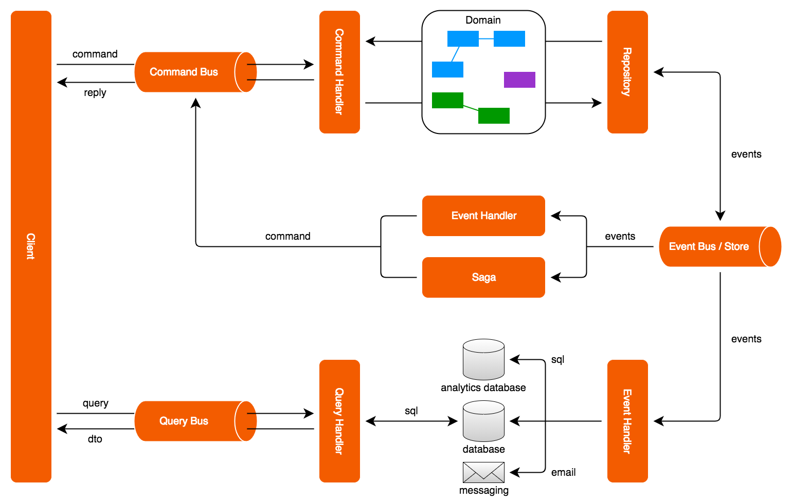

아키텍처 둘러보기
======================

CQRS는 자체만 보면 정말 간단한 패턴입니다. CQRS는 명령을 처리하기 위한 애플리케이션 컴포넌트와 조회를 위한 컴포넌트를 분리하도록 규정합니다. 명령 및 조회 컴포넌트를 분리하는 것은 그 자체로만 보면 단순해 보이지만, 다른 패턴들과 결합하게 되면 여러 가지 강력한 기능을 제공합니다. Axon은 CQRS와 조합하여 사용할 수 있는 다른 패턴들을 쉽게 구현할 수 있는 빌딩 블록(building block)들을 제공합니다.

아래의 다이어그램은 CQRS 기반의 이벤트 기반 아키텍처(event driven architecture)의 확장된 레이아웃입니다. 왼쪽에 표시된 UI(User Interface) 컴포넌트는 두 방향으로 애플리케이션의 다른 부분과 연동합니다. UI 컴포넌트는 애플리케이션으로 명령을 요청하고 다른 방향으로는 특정 정보를 얻기 위해 애플리케이션으로 조회 요청을 합니다. (조회 요청은 다이어그램의 하단을 보면 됩니다.)

명령들은 일반적으로 간단명료한 객체들로 표현이 되며, 명령을 표현하는 객체들은 명령 처리자(command handler)가 명령을 처리하는데 필요한 모든 데이터를 포함합니다. 명령의 이름만으로도 그 의도를 파악할 수 있어야 합니다. 즉, 명령 객체를 표현하기 위한 클래스의 이름과 명령 객체의 속성(field) 명을 통해 의도와 명령을 처리하는데 필요한 데이터가 무엇인지를 파악할 수 있어야 합니다.

커맨드 버스(Command Bus)는 명령들을 수신하고 명령을 처리할 수 있는 명령 처리자(command handler)에게 명령을 분배합니다. 개별 명령 처리자는 자신이 처리할 수 있는 특정 유형의 명령에만 응답하고 명령이 포함하고 있는 데이터를 가지고 선언된 로직을 실행합니다. 하지만 몇몇 경우에, 명령의 실제 유형에 상관없이 실행해야 하는 유효성 검사, 로깅(logging) 혹은 권한 확인과 같은 로직들이 있을 수 있습니다.

명령 처리자는 도메인 객체들(Aggregates)을 저장소에서 가져와 객체의 상태를 변경하기 위한 메서드를 실행(호출)합니다. 이런 집계 객체(aggregates)들은 일반적으로 실제 비즈니스  로직을 포함하고 있으므로 자신들의 불변성을 보호하는 책임집니다. 즉, 특정 객체의 상태를 변경은 명령 처리자를 통해 수행되는 것처럼 보이지만 실제로는 객체 자신이 자신의 상태에 대한 관리 책임을 지고 있습니다. 집계 객체의 상태 변경의 결과로 도메인 이벤트들이 발생이 됩니다. 도메인 이벤트와 집계 객체 둘 모두 도메인 모델을 구성하는 구성 요소들입니다.

저장소(repository)를 통해 집계 객체에 접근할 수 있으며, 일반적으로 저장소는 오로지 식별자만을 통해 집계 객체를 찾아 반환하도록 최적화되어 있습니다.

일부 저장소는 예를 들어 객체 관계형 매핑을 사용하여 집계 객체 자체의 상태를 저장하는 반면, 다른 저장소들은 집계 객체가 이벤트 스토어(event store)를 통해 적용한 상태의 변경을 저장합니다. 또한, 저장소는 집계 객체의 변경들을 백업 스토리지(storage)에 저장해야 하는 책임을 집니다.

Axon은 예를 들어 객체 관계형 매핑을 사용해 집계 객체를 직접 저장하는 방법과 이벤트 소싱(sourcing)에 대한 지원 제공합니다.

이벤트 버스(bus)는 시스템에 등록되어 특정 이벤트 수신을 원하는 이벤트 리스너(listener)로 이벤트를 전달합니다. 이벤트 전달은 동기 혹은 비동기 방식으로 이루어집니다. 비 동기 이벤트 전달은 백그라운드(background)에서 이벤트가 전달되고 처리되는 도중에, 명령의 실행 결과를 반환하고 사용자가 다른 제어 할 수 있도록 합니다. 이벤트 처리가 완료되기를 기다리지 않기때문에 애플리케이션의 반응성은 더 좋아지게 됩니다. 반면, 동기적인 이벤트 처리는 비교적 단순하고 기본적으로 설정되어 있는 처리 방법입니다. 기본적으로 동기 처리는 명령 처리와 이벤트 리스너를 처리를 동일한 트랜잭션(transaction)내에서 처리합니다.

이벤트 리스너는 이벤트를 수신하고 수신한 이벤트를 처리합니다. 일부 처리자(handler)들은 조회를 위한 데이터 소스(source)를 갱신하는 반면, 다른 처리자들은 외부 시스템으로 메시지를 전송합니다. 알고 있을 수 있겠지만, 명령 처리자들은 명령 처리자가 변경한 내용을 처리하는 컴포넌트들을 전혀 신경쓰지 않습니다. 이것이 의미하는 바는, 명령 처리자와 이벤트 리스너는 서로 의존 관계가 없는 독립적인 객체들입니다. 따라서 애플리케이션에 새로운 기능을 추가하여 확장하기 좋은 구조입니다. 단지 새로운 이벤트 리스너를 추가하면 됩니다. 이벤트는 애플리케이션의 모든 컴포넌트들을 약한 의존관계로 만들어 버립니다.

몇몇 상황에서, 이벤트를 처리하는 과정에서 새로운 명령을 보내야 하는 경우가 있습니다. 예를 들어, 새로운 주문이 들어왔을때, 고객계좌에서 고객이 구매한 제품의 가격만큼을 차감해야 하고 고객이 구매한 제품의 배송을 준비해야 합니다. 많은 애플리케이션에서 이보다 더 복잡한 로직을 구현해야 하는 경우들이 있습니다. 만약 고객이 제 시간에 결제를 하지 않는 다면, 배송을 해야 하는지 아니면 결제되기를 기다려야 하는지등을 고려해야 합니다. 이런 복잡한 비즈니스  트랜잭션을 처리하기 위해 사가(sage)라는 CQRS의 개념이 있습니다.

Axon 3.1 이후로, 조회 쿼리를 처리하기 위한 컴포넌트를 framework에서 제공합니다. 쿼리 버스(query bus)는 조회요청을 받아 해당 조회(쿼리)를 처리할 쿼리 처리자(handler)에게 분배합니다. 쿼리 처리자를 사용하기 위해선 쿼리 처리자를 자신이 처리할 쿼리 유형과 쿼리 실행 후 반환값의 유형과 함께 쿼리 버스에 등록해야 합니다. 쿼리와 결과 유형 모두 읽기 전용의 DTO 객체를 일반적으로 사용합니다. 개별 DTO 객체의 내용(속성)들은 일반적으로 사용자 인터페이스가 필요롤 하는 데이터들에 의해 결정이 됩니다. 대부분은, UI의 특정 뷰(view)에 직접 매핑됩니다 (또한 뷰-테이블(table per view)로 불려지기도 합니다.). 동일한 쿼리 그리고 반환 유형에 대한 다수의 쿼리 처리자를 등록할 수 있습니다. 쿼리를 전달할때, 클라이언트는 단일 쿼리자의 결과를 원하는지 사용 가능한 모든 쿼리 처리자의 결과를 원하는지를 지정할 수 있습니다.

Axon의 모듈 구조
=====================

Axon Framework는 CQRS의 특정 문제 영역에 해당하는 모듈들로 구성이 되어 있습니다. 개발하고자 하는 프로젝트의 필요에 따라 하나 혹은 그 이상의 모듈을 사용하시면 됩니다.

Axon 2.1의 경우, 모든 모듈은 OSGI에 호환 가능한 번들로 되어 있습니다. 각 모듈은 manifest 파일에 필요한 header들을 포함하고 있고 필요한 모듈과 외부에서 사용 가능한 모듈을 선언해 놓았습니다. 현시점에선, Slf4j 번들(1.7.0 <= version < 2.0.0)만이 필요합니다. 개발에 필요한 모듈이라 하더라도, 다른 모든 필요한 외부 모듈은 선택적 사항으로 표기되어 있습니다.

주(main) 모듈
------------

Axon의 주(main) 모듈들은 철저한 테스트를 거쳤으며 운영 환경에서도 충분히 사용 가능합니다.  모든 모듈의 메이븐(maven) groupId는 **axon.framework** 입니다.

핵심 모듈에는 이름에서 알 수 있듯이 Axon의 핵심 컴포넌트들이 포함되어 있습니다. 만약 단일 노드로 사용할 경우, 필요한 모둘 컴포넌트들을 핵심모듈에서 찾을 수 있습니다. 다른 모든 Axon 모듈들은 핵심 모듈을 필요로 하므로, 핵심 모듈은 반드시 클래스 패스(classpath)* 에 있어야 합니다.

> 참고
>
> 클래스 패스(classpath): JRE(Java Runtime Environment)이 애플리케이션 실행 시(실행환경), 필요한 클래스들(혹은 필요한 리소스)을 찾는 위치를 의미합니다.

테스트 모듈은 명령 처리자(command handler), 집계 객체(aggregate) 그리고 사가(saga)들과 같은 Axon 기반의 컴포넌트를 테스트 하기 위한 테스트 픽스쳐(fixture)를 포함하고 있습니다. 보통 애플리케이션을 실행할 때는 테스트 모듈이 필요하지 않고 테스트를 실행하는 경우에만 필요합니다. 따라서 메이븐을 사용할 경우, scope을 test로 설정하여 사용하면 됩니다.

분산 명령 버스(Distributed CommandBus) 모듈은 다중 노드 환경* 에서 명령을 분산하기 위한 구현체들을 포함하고 있습니다. 분산 명령 버스(Distributed CommandBus) 모듈에는 다중 노드들을 연결하기 위한 JGroups와 Spring Cloud Connectors가 함께 제공됩니다.

> 참고
>
> 다중 노드 환경: 각 노드는 애플리케이션을 실행 할 수 있는 환경이 마련되어 있어야 하며, 동일 레벨의 다른 노드에 종속적이지 않은 상태에서 애플리케이션을 실행 할 수 있어야 합니다. 이런 노드들이 하나 이상 존재하는 환경을 의미 합니다.

AMQP 모듈은 AMQP 기반의 메시지 브로커(broker)를 분산 메커니즘으로 사용하여 이벤트 버스(EventBus)를 구축할 수 있는 컴포넌트들을 제공합니다. AMQP 모듈을 사용하여 이벤트 버스를 구축하면, 이벤트 처리자(handler)가 일시적으로 사용할 수 없더라도, 나중에 이벤트 처리자가 사용 가능한 상태로 복구되면 메시지가 잘 전달될 수 있도록 할 수 있습니다.

스프핑(Spring) 모듈을 사용해서 Axon 컴포넌트들을 스프링 애플리케이션 컨텍스트에 빈(Bean)으로 설정할 수 있습니다. 또한, 스프링 메시지 채널을 통해 Axon 이벤트들을 주고받을 수 있도록 하는 어댑터(adaptor)와 같은 스프링 프레임워크에서 사용 가능한 구현체들을 제공합니다.

몽고(Mongo)DB는 NoSQL 데이터베이스를 기반으로한 도큐먼트로, 몽고 모듈에서 제공하는 이벤트 스트림(stream)과 사가들을 저장하기 위한 이벤트 스토어와 사가 스토어의 구현체들을 사용하여 몽고DB와 연동할 수 있습니다.

여러 Axon Framework 컴포넌트들을 모니터링 정보를 제공합니다. 매트릭스(metrics) 모듈은 모니터링 정보를 수집하는 CodeHale에 기반을 둔 구현체들을 제공합니다.

Axon API 사용하기
======================

CQRS는 아키텍처적인 패턴으로, 모든 프로젝트에 적용 가능할 수 없습니다. Axon Framework는 하나의 해결책을 제공하는 것이 아닌, 모범 사례를 따르는 구현체와 구현해야 하는 요구 사항에 맞는 구현체들을 상황에 맞도록 조정하는 방법을 제공합니다.

거의 대부분의 인프라로 제공되는 빌딩 블록들은 인터셉터, 리졸버와 같은 후크 포인트(hook point)\* 를 제공합니다. 후크 포인트를 사용하여 애플리케이션의 특정 행위를 추가할 수 있습니다. 대부분은, Axon이 제공하는 후크 포인트에 대한 구현체들을 사용하여 애플리케이션의 특정 행위를 구현할 수 있습니다. 필요에 따라, 직접 구현하여 사용할 수도 있습니다.
> 참고
>
> 용어 후킹은 운영 체제, 응용 프로그램 또는 다른 소프트웨어 구성 요소의 동작을 소프트웨어 구성 요소 간에 전달되는 함수 호출이나 메시지 또는 이벤트를 가로채어 변경하거나 보강하는 데 사용되는 다양한 기술을 망라합니다. 이러한 가로채기 된 함수 호출, 이벤트 또는 메시지를 처리하는 코드를 후크 (hook)라고합니다. ( \*출처: [위키피디아](https://en.wikipedia.org/wiki/Hooking))

메시지와 같은 비-인프라 객체들은 일반적으로 불변객체입니다. 불변성을 통해 다중 스레드 환경에서 부작용 없이 안전하게 해당 객체들을 사용할 수 있습니다.

최대한 사용자의 확장성을 보장하기 위해, Axon의 모든 컴포넌트는 인터페이스들을 사용하여 정의되어 있습니다. 추상 클래스와 일반 구현체 클래스들은 개발을 돕기 위해 제공되지만, Axon Framework는 구체적인 구현체에 종속적이지 않습니다. 따라서 Axon에서 제공하는 인터페이스를 사용하여 직접 구현한 빌딩 블록들을 언제든지 사용할 수 있습니다.

스프링 지원
==============

Axon Framework는 스프링을 광범위하게 지원하지만 Axon을 사용하기 위해 스프링을 사용할 필요는 없습니다. 모든 컴포넌트는 스프링없이도 프로그램 코드로 설정이 가능합니다. 하지만 스프링을 사용한다면, 스프링에서 제공하는 애노테이션(annotation)을 사용해서 보다 쉽게 많은 부분의 설정을 할 수 있습니다.
