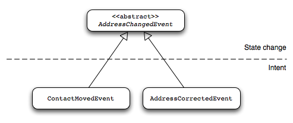

메세징 알아보기
==================

메세징(Messaging)은 Axon의 핵심 개념 중 하나로, 컴포넌트 간의 모든 연동은 메시지 객체를 통해 이루어집니다. 메시지를 통해 연동하므로, 각 컴포넌트는 위치 투명성(location transparency)을 가지게 되어 필요에 따라 규모를 가변적으로 만들 수 있고 분산시킬 수 있습니다.

모든 메시지 객체들은 `Message` 인터페이스를 구현하지만, 메시지들의 다양한 유형과 처리 방법은 명확하게 구별이 됩니다.

모든 메시지는 페이로드(payload), 메타 데이터 그리고 유일한 식별자 값을 포함합니다. 메시지의 페이로드는 메시지가 의미하는 것에 대한 기능적 설명입니다. 객체의 클래스 명과 객체가 포함한 데이터의 조합은 메시지가 애플리케이션 내에서 가지는 의미를 설명합니다. 메타 데이터를 통해 전송된 메시지의 컨텍스트를 알 수 있습니다. 예를 들어, 메시지의 발생지 혹은 원인 등을 추적하여 저장할 수 있습니다. 명령(command)이 실행되는 환경의 보안 컨텍스트를 저장할 수 있습니다.

> **참고**
>
> 모든 메시지는 불변 객체이기 때문에, 메시지에 데이터를 저장하는 것은 기존 메시지를 기반으로 새로운 메시지를 생성하는 것을 말합니다. 메시지의 불변성으로 인해 다중 스레드 및 분산 환경하에서 메시지를 안전하게 사용할 수 있습니다.

명령 객체
--------

명령(command)은  애플리케이션의 상태를 변경하려는 의도를 나타냅니다. 명령 객체는 **CommandMessage** 구현체 중의 하나로 포장(wrapping)된 POJO 객체로 구현할 수 있습니다. (보통 읽기 전용으로 구현하는 것을 선호합니다.)

명령 객체들은 항상 단 하나의 목적지를 가져야 합니다. 명령을 전송하는 측은 어떤 컴포넌트가 해당 명령을 처리할지 혹은 명령을 처리할 컴포넌트가 어디에 위치하는지를 상관하지 않지만, 명령을 처리한 후의 결과를 필요로 할 수는 있습니다. 이런 이유로 명령 처리 결과를 반환할 수 있는 커맨드 버스(CommandBus)를 통해 명령 메시지가 전달 되는 것입니다.

이벤트
------

이벤트는 애플리케이션 내에서 발생한 사건을 나타냅니다. 보통 이벤트는 Aggregate으로부터 발생이 됩니다. Aggregate으로부터 중요한 사건이 발생하였다면, 그 발생한 사건은 이벤트를 발생시킵니다. Axon Framework에선, 모든 객체를 이벤트로 만들 수 있습니다. 단, 모든 이벤트는 반드시 직력화 가능(serializable) 객체이어야 합니다.

이벤트가 전파될 때, Axon은 해당 이벤트를 **Event Message**로 감싸줍니다. 사용되는 메시지의 실제 유형(타입)은 이벤트의 발생지에 따라 다르며, Aggregate로부터 발생한 경우에는 **Event Message**의 하위 객체인 **DomainEventMessage**로 감싸게(wrapped) 됩니다. Aggregate로부터 발생한 이벤트가 아닌 다른 모든 이벤트는 **Event Message** 로 감싸게 됩니다. 고유 식별자와 같은 일반적인 속성 외에 **Event Message**는 타임스탬프(timestamp)도 포함합니다. **DomainEventMessage**는 추가로 이벤트를 발생시킨 aggregate의 식별자와 유형(타입)을 포함하고 있으며, aggregate의 이벤트 스트림(stream)의 범위 내에서의 이벤트의 순차적인 번호까지 포함하고 있습니다. 이벤트의 순차적인 번호는 이벤트를 발생한 순서대로 재현하기 위해 사용할 수 있습니다.

> **참고**
>
> **DomainEventMessage**가 Aggregate의 식별자에 대해 참조를 하고 있다 하더라도, 실제 발생한 이벤트의 식별자를 포함해야 합니다.
> 이벤트 스토어(EventStore)가 이벤트를 저장하기 위해 **DomainEventMessage** 의 식별자를 사용하며, 다른 용도로 사용하기에는 적절하지 않을 수 있습니다.

원본 이벤트 객체는 이벤트 메시지의 페이로드(payload)로 저장이 됩니다. 페이로드 다음으로, 감사용 정보 등의 목적으로 사용할 수 있는 비즈니스  로직 용도가 아닌 데이터를 저장하기 위해 이벤트 메시지의 메타 데이터를 활용할 수 있습니다. 메타 데이터를 활용하면, 이벤트 프로세싱에 사용된 계정 혹은 장비명 등의 이벤트가 발생한 당시의 환경에 대한 정보를 파악할 수 있습니다.

> **참고**
>
> 일반적으로, 이벤트 메시지에 포함된 메타 데이터를 가지고 비즈니스  결정을 해서는 안 됩니다. 비즈니스  용도로 특정 데이터를 활용하기 위해선, 메타 데이터가 아닌 이벤트 자체에 해당 데이터를 추가하여 사용해야 합니다. 전형적으로 보고서, 감사 그리고 추적용으로 메타 데이터를 사용하기 때문입니다.

필수 사항은 아니지만, 도메인 이벤트를 불변 객체로 만들어 사용하는 것이 좋습니다. 보통 모든 속성(멤버 변수)를 final로 선언하고 생성자를 통해 속성들을 초기화하는 방법이 선호됩니다. 이벤트를 생성하는 것이 생각보다 까다롭다면, 빌더 패턴(builder pattern)을 사용하는 것도 고려할 수 있습니다.

> **참고**
>
> 원칙적으로 도메인 이벤트들은 상태의 변경을 나타내지만, 변경의 의도 또한, 표현해야 합니다. 특정 상태의 변경에 대한 이벤트를 추상 구현체로 만들고 변경의 의도를 나타내기 위한 상세한 하위 구현체를 사용하는 것이 좋은 방법입니다.
> 예를 들어 상태의 변경을 나태내기 위해 추상 구현체로 **AddressChangedEvent** 를 사용하고, 상세 의도를 표현하기 위한 두 개의 하위 구현체로 **ContactMovedEvent** 와 **AddressCorrectedEvent** 를 사용할 수 있습니다.
> 몇몇 이벤트 리스터(listener)들은 이벤트의 의도에 별 개의치 않습니다. (예, 데이터베이스에 값을 갱신하는 이벤트 리스트) 이런 리스너들은 추상 타입(상위 타입)의 객체를 받아 처리하지만, 이벤트의 변경 의도에 맞는 하위 타입의 객체를 받아 처리하는 리스너들을 사용하여 주소 변경에 대한 이메일 알림을 을 고객에게 발송하도록 할 수 있습니다.
>
> 

이벤트 버스로 이벤트를 전달할 때, 해당 이벤트를 이벤트 메시지로 감싸줘야 합니다. **GenericEventMessage** 를 사용하여 해당 이벤트를 이벤트 메시지 안에 포함 시킬 수 있으며, 이때 **GenericEventMessage** 의 생성자 혹은 클래스 메서드인 **asEventMessage()** 메서드를 사용할 수 있습니다. **asEventMessage** 메서드는 주어진 이벤트가 이미 **EventMessage** 이면, 바로 이벤트를 반환하고 Message의 하위 객체라면 주어진 이벤트를 **GenericEventMessage** 로 반환하는데, 주어진 이벤트(메시지 하위 객체)의 페이로드와 메타 테이터를 사용 그대로 사용하게 됩니다. 특정 이벤트가 Aggregate로부터 발생하였다면, Axon은 해당 이벤트를 **DomainEventMessage** 로 감싸주게 되며, **DomainEventMessage** 는 Aggregate의 식별자, 유형(타입) 그리고 일련 번호를 포함하게 됩니다.

질의
-------

질의는 상태나 정보에 대한 요청을 나타냅니다. 질의를 처리하는 처리자는 여러 개가 있을 수 있습니다. 질의들을 전달할 때, 하나의 질의 처리자 혹은 가능한 모든 질의 처리자로부터 결과를 원하는지를 명시 해야 합니다.

작업 단위
------------

Axon Framework에서 **작업 단위(Unit of Work)**는 중요한 개념이지만, 대부분은 이를 직접 다루는 일은 거의 없을 것입니다. 메시지의 처리는 단일 단위로 처리되는 것으로 보입니다. 작업 단위의 목적은 명령 혹은 이벤트와 같은 메시지를 처리하는 동안 수행된 작업을 조정하는 것입니다. 컴포넌트들은 onPrepareCommit이나 onCleanup과 같은 작업 단위의 개별 단계에서 실행할 작업을 등록할 수 있습니다.

작업 단위에 직접 접근하여 작업할 일은 없을 것입니다. 작업 단위는 Axon에서 제공하는 빌딩 블록들이 주로 사용을 합니다. 만일 작업 단위를 사용해야 한다면, 몇 가지 방법이 있습니다. 처리자(handler)의 `handle` 메서드에 작업 단위를 추가로 선언하여 처리자가 이를 받아 볼 수 있도록 할 수 있습니다. 에노테이션을 사용한다면, 에노테이션이 사용된 메서드에 `UnitOfWork` 타입의 매개변수를 추가할 수 있습니다. 처리자가 아닌 다른 곳에서 작업 단위를 사용하기 위해선, 현재의 스레드에 묶여있는(bound) 작업 단위를 `CurrentUnitOfWork.get()` 메서드를 통해 받아 올 수 있습니다. `CurrentUnitOfWork.get()`메서드 사용 시 유의점은 현재 스레드에 묶여 있는 작업 단위가 없다면 예외가 발생 할 수 있습니다. 따라서 `CurrentUnitOfWork.get()`메서드 사용 전에 `CurrentUnitOfWork.isStarted()`메서드를 통해 현재 사용 가능한 작업 단위가 있는지를 확인해야 합니다.

메시지의 처리를 수행하는 동안 여러 번 재사용할 수 있는 자원을 작업 단위에 첨부하거나, 작업 단위가 완료되었을 때, 첨부된 자원을 해제하기 위해 작업 단위에 접근할 필요가 있습니다. 이런 경우 `unitOfWork.getOrComputeResource()`와 `onRollback()`, `afterCommit()` 그리고 `onCleanup()`같은 생애 주기 이벤트에 따라 호출되는 메서들을 통해 작업 단위에 자원을 등록하고 작업 단위를 처리하는 동안 실행되어야 할 작업을 선언할 수 있습니다.

> 참고
>
> 작업 단위(Unit of Work)는 단지 변경을 임시 저장하는 버퍼일 뿐입니다. 트랜잭션을 대체하는 것이 아닙니다. 모든 단계적 변경 사항들은 작업 단위가 커밋될 때만 커밋이 되지만, 원자 적이지는 않습니다. 다시 말하면, 커밋을 실패했을 때, 일부 변경은 영속화가 되었을 수 있지만 다른 나머지는 그렇지 않을 수 있습니다. 따라서 하나의 명령에 하나 이상의 작업을 포함 시키지 않는 것을 권장합니다. 이런 권장 사항을 지킨다면, 작업 단위는 단일 작업만을 포함하게 되므로 있는 그대로 안전하게 사용할 수 있습니다. 그렇지만 만일 작업 단위에 하나 이상의 작업을 포함 시켜야 한다면, 작업 단위의 커밋을 하나의 트랜잭션으로 처리하도록 해야 합니다. 작업 단위가 커밋될 때, 수행되어야 할 작업은 `unitOfWork.onCommit(..)`을 사용하여 등록하면 됩니다.

작성한 처리자는 메시지의 처리 결과로 예외를 발생 시킬 수 있습니다. 기본적으로, unchecked 예외들이 발생하면 작업 단위는 모든 변경 사항을 롤백(rollback)처리 합니다. 결과적으로 발생할 수 있는 부작용(side effect)는 취소되어 발생하지 않게 됩니다.

Axon은 아래와 같은 몇가지 롤백 전략을 제공합니다.
 - `RollbackConfigurationType.NEVER`는 항상 작업 단위를 커밋합니다. 롤백을 절대 수행하지 않는 것이죠.
 - `RollbackConfigurationType.ANY_THROWABLE`은 예외의 종류에 상관없이 예외가 발생되면 항상 롤백합니다.
 - `RollbackConfigurationType.UNCHECKED_EXCEPTIONS`은 **Errors**와 **RuntimeException** 의 예외가 발생했을 때, 롤백합니다.
 - `RollbackConfigurationType.RUNTIME_EXCEPTION`은 **RuntimeException** 의 예외가 발생했을 때만 롤백 합니다.

메시지 처리를 위해 Axon 컴포넌트를 사용할 때, 작업 단위의 생애주기는 자동으로 관리됩니다. Axon 컴포넌트를 사용하지 않고 직접 구현한 컴포넌트를 사용한다면, 작업 단위의 시작 및 커밋을 직접 코드로 작성해 주어야 합니다.

대부분은, 필요한 기능들은 `DefaultUnitOfWork`를 통해 사용할 수 있습니다. 단일 스레드에서 처리가 이루어질 것으로 생각됩니다. 작업 단위의 컨텍스트내에서 작업을 수행하려면, `UnitOfWork.execute(Runnable)`이나 `UnitOfWork.executeWithResult(Callable)`을 새로운 `DefaultUnitOfWork`에서 호출하면 됩니다. 해당 작업이 종료될 때 작업 단위는 시작되고 종료됩니다. 단 작업이 실패할 경우, 작업 단위는 롤백 됩니다. 좀 더 세세한 제어가 필요할 경우, 작업 단위를 수동으로, 직접 시작, 커밋 혹은 롤백할 수 있습니다.

작업 단위의 일반적인 사용법은 아래와 같습니다.

``` java
UnitOfWork uow = DefaultUnitOfWork.startAndGet(message);
//아래와 같이 자동 커밋을 사용할 수 있습니다.
uow.executeWithResult(() -> ...처리할 비즈니스  로직을 이곳에 작성합니다.);

//혹은 아래와 같이 직접 커밋 혹은 롤백 처리를 할 수 있습니다.
try {
  //처리할 비즈니스  로직을 이곳에 작성합니다.
  uow.commit();
} catch(Exception e) {
  uow.rollback(e);
  // 발생한 예외를 다시 던질 수 도 있습니다.
}
```

작업 단위는 활성 단계(active phase), 커밋 단계(commit phase) 그리고 종료 단계(cleanup phase) 등과 같은 여러 단계들로 처리되며, 각 단계가 처리될 때마다 작업 단위 리스너(UnitOfWork Listener)에게 통보합니다.

* 활성 단계(Active phase): 작업 단위가 시작하는 단계로 일반적으로 해당 작업 단위를 `CurrentUnitOfWork.set(UnitOfWork)`메서드를 통해 현재의 스레드에 등록합니다. 그다음에, 메시지 처리자를 통해 메시지를 처리하도록 합니다.
* 커밋 단계 (Commit phase): 메시지 처리를 완료한 후, 하지만 작업 단위가 커밋되기 전에 `onPrepareCommit` 리스너들을 호출 합니다. 만약 작업 단위가 트랜잭션에 물려 있다면, 지원 가능한 트랜잭션을 커밋하기 위해 `onCommit` 리스너들을 호출합니다. 성공적으로 커밋을 완료하면, `afterCommit` 리스너들을 호출하고 만일 커밋 혹은 이전 단계들이 실패할 경우, `onRollback` 리스너들을 호출합니다. 가능하다면, 메시지 처리자가 반환한 결과는 작업 단위의 `ExecutionResult`에 포함됩니다.
* 종료 단계(Cleanup phase): 작업 단위가 사용했던 락(lock)과 같은 자원들을 해제하기 위한 단계입니다. 만일 여러 작업 단위가 중첩되어 있다면, 가장 바깥의 작업 단위가 종료 준비될 때 까지 종료 단계는 지연이 됩니다.

메시지 처리 과정은 원자 적으로 생각할 수 있습니다. 왜냐면 전체가 처리 완료되거나 그 어떤 것도 처리되지 않기 때문입니다. Axon Framework는 메시지 처리자가 실행하는 작업을 추적하기 위해 작업 단위(Unit of Work)를 사용합니다.  메시지 처리자가 메시지 처리를 완료한 후, Axon은 작업 단위에 등록되어 있는 작업을 커밋합니다.

작업 단위에 트랜잭션을 묶을 수 있습니다. 커맨드 버스 구현체들과 비동기 처리를 위한 이벤트 프로세서 등과 같은 많은 컴포넌트를 통해 트랜잭션 매니져를 설정할 수 있습니다. 트랜잭션 매니져를 사용하여 메시지 처리를 위한 작업단위에 묶을 트랜잭션을 생성할 수 있습니다.

애플리케이션 컴포넌트들은 메시지 처리의 각 단계마다 데이터베이스 연결 혹은 엔티티 매니져(EntityManager)와 같은 자원을 필요로 하는데, 이런 자원들을 작업 단위에 첨부하여 컴포넌트들이 사용할 수 있도록 할 수 있습니다. `unitOfWork.getResources()`메서드를 통해 현재 작업 단위에 첨부된 자원들을 사용할 수 있습니다. 해당 자원들을 더욱 쉽게 사용하기 위한 작업 단위의 여러 헬퍼(Helper) 메서드들을 직접 사용할 수 있습니다.

중첩된 작업 단위에서 자원을 사용하도록 하기 위해선, 최상위 작업 단위에 해당 자원을 첨부하고 중첩 작업 단위에선 `unitOfWork.root()` 메서드를 통해 최상위 작업 단위에 접근하여 해당 자원을 사용하도록 하는 것이 좋습니다. 만약 최상위 작업 단위에서 `unitOfWork.root()` 메서드를 사용하게 되면, 해당 메서드는 자기 자신을 반환합니다.
