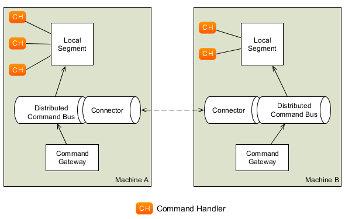

명령 전달 하기
===================

명시적인 명령 전달 메커니즘을 사용하면 좋은 점들이 있습니다. 그 중 첫 번째는 클라이언트의 의도를 명확히 묘사하는 단일 객체가 있다는 것입니다. 명령을 로깅 하여, 클라이언트의 의도와 관련 데이터들을 나중에 사용할 목적으로 저장할 수 있습니다. 명령 처리를 통해 예를 들어 웹 서비스 등을 통해 원격의 클라이언트에게 명령 처리 컴포넌트를 쉽게 노출 시킬 수 있습니다. 시작 상황(given), 실행할 명령(when) 그리고 기대 결과(then)로 이벤트들과 명령들을 열거하는 형식으로 테스트 스크립트를 정의할 수 있어서 테스트를 더 쉽게 수행할 수 있습니다([테스트](../part2/testing.md)를 참고하세요). 마지막 주요 이점은 동기와 비동기 간 변경뿐만 아니라 로컬 기반 명령 처리를 분산 환경의 명령 처리로의 변경을 매우 쉽게 처리할 수 있다는 것입니다.

명시적인 명령 객체를 사용한 명령 전달 처리만이 위와 같은 처리를 하는데 유일한 방법은 아닙니다. Axon의 목적은 특정 방법을 규정하는 것이 아니라 기본적 구현으로서 모범 사례를 제공하면서 사용자 나름의 방법을 지원하는 것입니다. 따라서 명령 실행을 위한 서비스 계층(layer)을 사용할 수 있으며 서비스 계층의 메서드는 작업 단위를 시작하고([작업 단위](../part1/messaging-concepts.md#unit-of-work)를 참고하세요) 메서드의 종료에 따라서 커밋 혹은 롤백을 수행합니다.

다음 장에서는, Axon Framework을 사용하여 명령 전달 기반 구조의 구성과 관련된 작업의 개요를 살펴볼 것입니다.

커멘드 게이트웨이
===================

커멘드 게이트웨이는 명령 전달 메커니즘에 대한 인터페이스입니다. 명령을 전달하기 위해 게이트웨이를 사용할 필요는 없지만, 일반적으로 게이트웨이를 사용하는 것이 가장 쉬운 방법입니다.

커멘드 게이트웨이를 사용하기 위한 두 가지 방법 중, 첫 번째 방법은 Axon에서 제공하는 `CommandGateway` 인터페이스와 `DefaultCommandGateway` 구현체를 사용하는 것입니다. Command Gateway를 통해 명령을 전송한 후에, 결과를 동기적으로 기다리도록 처리할 수 있고, 시간제한 및 비동기적으로도 처리할 수 있습니다.

다음으로 사용할 수 있는 가장 유연한 방법으로, `CommandGateWayFactory`를 사용하여 거의 모든 인터페이스를 Command Gateway로 변경하는 방법입니다. 정확한 타입 정보와 비즈니스 관련 예외를 사용해서 정의된 애플리케이션 인터페이스를 정의하고, Axon을 통해 해당 인터페이스를 런타임(실행 시점)에 자동으로 해당 인터페이스에 대한 구현체를 생성할 수 있습니다.

커멘드 게이트웨이 설정하기
-------------------------------

사용자 정의 게이트웨이와 Axon에서 제공하는 게이트웨이 모두 커맨드 버스(command bus)에 접근하기 위한 설정이 필요합니다. 또한, 커맨드 게이트웨이는 `RetryScheduler`, `CommandDispatchInterceptor` 그리고 `CommandCallback`을 통해 설정을 해야 합니다.

명령 실행이 실패했을 경우 `RetryScheduler`을 통해, 명령 처리에 대한 재시도에 스케쥴링을 할 수 있습니다. `RetryScheduler`의 구현체인 `IntervalRetryScheduler`를 통해, 명령 처리가 성공할 때까지 일정한 간격으로 주어진 명령 처리를 재시도하거나, 최대 재시도 횟수만큼 명령을 처리를 재차 시도할 수 있습니다. 하지만 일시적인 예외가 아닌 예외 사항으로 명령 처리에 실패했을 때, 재시도는 이루어지지 않습니다. `RetryScheduler`는 명령 처리가 `RuntimeException`으로 실패한 경우에만 호출됩니다. 확인된 예외(Checked exceptions)는 "비즈니스 예외"로 간주하여 절대 재시도를 하지 않습니다. 분산 환경에서 커맨드 버스를 사용하여 명령 처리를 할 때 주로 `RetryScheduler`를 사용합니다. 한 노드가 실패했을 때, `RetryScheduler`를 사용해서 다른 사용 가능한 노드로 해당 명령을 분산하여 명령이 처리될 수 있도록 조치합니다. (참조: [분산 커맨드 버스](#커맨드-버스-분산하기))

`CommandDispatchInterceptor`를 통해, 커맨드 버스로 명령이 전달되기 전에 명령 메시지(`CommandMessage`)를 변경할 수 있습니다. `CommandDispatchInterceptor`는 `CommandBus`에 설정이 되지만, 메시지들이 게이트웨이를 통해서 전달되는 경우에만 설정된 인터셉터들은 호출됩니다. 예를 들어, 인터셉터들을 사용하여 메타 데이터를 추가하거나 검증을 수행할 수 있습니다.

`CommandCallback`은 각각 전송된 명령에 대해 호출이 됩니다. 명령의 타입에 상관없이, 게이트웨이를 통해 전송되는 모든 명령에 대해 일반적인 기능을 수행할 수 있습니다.

사용자 정의 Command Gateway 생성하기
---------------------------------

Command Gateway를 재정의한 인터페이스를 사용할 수 있습니다. 인터페이스에 정의된 각각의 메서드들은 매개변수, 반환 타입 그리고 선언된 예외 사항으로 어떤 기능을 하는지 알 수 있습니다. 인터페이스로 선언된 게이트웨이를 사용하면 사용의 간편성뿐만 아니라 mock을 사용하여 테스트를 더 쉽게 진행할 수 있도록 해줍니다.

다음을 통해 매개변수들이 Command Gateway의 기능(행위)에 어떤 영향을 미치는지 살펴보겠습니다.

-   Command Gateway의 `send`, `sendAndWait` 메서드들의, 첫 번째 매개변수는 전달될 실제 명령 객체이어야 합니다.

-   `@MetadataValue` 에노테이션이 사용된 매개변수의 값은 에노테이션 매개변수로 전달된 식별자를 통해 메타데이터 필드에 할당이 됩니다.

-   `MetaData` 타입의 매개변수는 커멘드 메시지(Command Message)의 `MetaData`와 합쳐지게 되며, 같은 키를 가지는 항목은 이후에 정의된 메타 데이터 항목으로 덮어쓰게 됩니다.

-   `CommandCallback` 타입의 매개변수는 명령 처리 이후 호출되는 `onSuccess` 혹은 `onFailure` 메서드를 가집니다. 하나 이상의 콜백을 전달할 수 있으며, 처리된 명령과 결과 값을 인자로 콜백 객체에 전달하여 호출합니다.

-   마지막 두 개의 매개변수들은 각각 `long`(혹은 `int`) 그리고 `TimeUnit` 타입일 것입니다. 이 경우, 매개변수들이 나타내는 시간 동안 해당 메서드는 블럭킹되어 메서드가 완료될 때까지 대기합니다. 타임아웃 발생에 대한 반응 및 처리는 메서드에 선언된 예외에 따라 달라집니다. 메서드의 다른 속성들이 블럭킹을 방지하게 되면, 타임아웃은 절대 발생하지 않습니다.

메서드에 선언된 반환 타입 또한 아래와 같이 메서드의 행위에 영향을 미칩니다.

- `Void`반환 타입은 해당 메서드에 타임아웃 혹은 선언된 예외 사항 같은 대기해야 한다는 지시가 없다면, 해당 메서드가 즉시 반환하도록 합니다.

- `Future`, `CompletionStage` 그리고 `CompletableFuture`의 반환 타입은 메서드가 즉시 반환되도록 합니다. 메서드가 반환하는 `CompletableFuture` 인스턴스를 통해 명령 처리자의 결과에 접근할 수 있습니다. 메서드에 선언된 예외나 타임아웃은 무시됩니다.

- 다른 반환 타입들을 사용하면, 해다 메서드는 사용 가능한 결과가 나올 때까지 블럭킹 되어 결과를 기다리게 됩니다. 결괏값은 반환 타입으로 캐스팅되며, 타입이 맞지 않으면 `ClassCastException`이 발생하게 됩니다.

메서드에 선언된 예외 사항들은 아래와 같은 영향을 미칩니다.

- 명령 처리자(혹은 인터셉터)에서 확인된 예외(checked exception)를 던진다면, 같은 예외가 해당 메서드에서도 발생 될 것입니다. 만약 해당 예외를 선언하지 않는다면 발생한 예외는 `RuntimeException`인 `CommandExecutionException`로 감싸져서 발생하게 됩니다.

- 타임아웃이 발생하면, 해당 메서드는 `null`을 기본으로 반환합니다. `null`을 반환하는 대신, `TimeoutException`을 선언하여 `TimeoutException`을 대신 던지도록 할 수 있습니다.

- 결과를 기다리는 동안 대기 중인 스레드가 중단(interrupted)된다면, 해당 메서드는 기본적으로 `null`을 반환합니다. 이 경우, 스레드가 중단된 것을 나타내는 값(interrupted flag)을 해당 스레드에 설정합니다. 해당 메서드에 `InterruptedException`을 선언하여, interrupted flag가 설정되는 것 대신 `InterruptedException` 예외를 발생시킬 수 있습니다. 예외가 발생하였을 경우, interrupted flag 값은 Java specification에 따라 삭제됩니다.

- 다른 런 타임 예외들을 메서드에 선언하면, API를 사용하는 사용자에게 설명해 주는 것 외에 다른 효과는 없습니다.

마지막으로, 에노테이션들을 사용할 수 있습니다.

- `@MetaDataValue` 에노테이션을 사용하여 메타 데이터값들을 메서드의 인자로 받아 볼 수 있습니다. 메타 데이터의 키값은 에노테이션의 매개변수로 선언하여 사용합니다.

- `@Timeout` 에노테이션을 메서드에 사용하면, 최대 에노테이션에 지정된 시간만큼 메서드는 블럭킹되어 결과를 기다리게 됩니다. 단 메서드에 타임아웃 매개변수를 선언하면 이 에노테이션은 무시됩니다.

- `@Timeout`을 클래스에 사용하면, 해당 클래스에 선언된 모든 메서드들에 해당 에노테이션이 적용됩니다. 따라서 클래스의 모든 메서드들은 최대 에노테이션에 지정된 시간만큼 메서드는 블럭킹되어 결과를 기다리게 됩니다. 단 메서드에 선언된 `@Timeout` 에노테이션이 우선 적용됩니다.

``` java
public interface MyGateway {

    // 전송하고 잊어버리는 전략입니다.
    void sendCommand(MyPayloadType command);

    // "userId"라는 메터 데이터를 가지고 10초의 타임아웃을 가지는 메서드입니다.
    @Timeout(value = 10, unit = TimeUnit.SECONDS)
    ReturnValue sendCommandAndWaitForAResult(MyPayloadType command,
                                             @MetaDataValue("userId") String userId);

    // 타임아웃이 발생했을때, 예외를 던지는 메서드입니다.
    @Timeout(value = 20, unit = TimeUnit.SECONDS)
    ReturnValue sendCommandAndWaitForAResult(MyPayloadType command)
                         throws TimeoutException, InterruptedException;

    // 아래의 메서드를 호출하는 client가 timeout 값을 지정합니다.
    void sendCommandAndWait(MyPayloadType command, long timeout, TimeUnit unit)
                         throws TimeoutException, InterruptedException;
}

// 게이트웨이 설정:
CommandGatewayFactory factory = new CommandGatewayFactory(commandBus);
// commandBus는 'configurer.buildConfiguration()' 메서드가 반환하는 Configuration객체를 통해 얻을 수 있습니다.
MyGateway myGateway = factory.createGateway(MyGateway.class);
```

커맨드 버스
===============

커맨드 버스(Command Bus)는 각각의 명령 처리자에게 명령들을 전달하기 위한 메커니즘을 말합니다. 각각의 명령은 정확히 하나의 명령 처리자에게 전달됩니다. 만약 명령을 처리할 처리자가 없다면, `NoHandlerForCommandException`이 발생합니다. 같은 명령 타입에 대해 다수의 명령 처리자를 등록하게 되면, 마지막에 등록한 명령 처리자가 등록되어 해당 명령을 처리하게 됩니다.

명령 전달하기
--------------------

`CommandBus`는 각각의 처리자에게 명령을 전달하기 위한 두 개의 메서드를 제공합니다. 해당 메서드들은 `dispatch(commandMessage, callback)`과 `dispatch(commandMessage)`이며, 두 메서드의 공통된 매개변수이면서 첫 번째 매개변수는 전달될 실제 명령을 포함하고 있습니다. 선택적인 두 번째 매개변수로 전달되는 콜백 객체는 명령 처리가 완료되면 명령을 전송한 컴포넌트에 완료 여부를 알리는 용도로 사용할 수 있습니다. 해당 콜백은 명령 처리가 정상적으로 처리되었을 때 호출되는 `onSuccess`와 예외 발생 등의 상황에서 호출되는 `onFailure` 두 개의 메서드를 가집니다.

명령이 전달되는 스레드와 콜백이 호출되는 스레드는 다를 수 있으므로, 호출하는 스레드가 다음 로직을 진행하기 전에 결과를 원한다면, `FutureCallback`을 사용하여 처리할 수 있습니다. `FutureCallback`은 Java의 `java.concurrent` 패키지에 정의된 `Future`와 Axon에서 제공하는 `CommandCallback`의 조합입니다. 다른 대안으로는 커맨드 게이트웨이의 사용을 생각해 볼 수 있습니다.

만약 명령 처리의 결과에 관심이 없다면, `dispatch(commandMessage)` 메서드를 사용하면 됩니다.

심플 커맨드 버스(SimpleCommandBus)
----------------

`SimpleCommandBus`는 이름에서 알 수 있듯이, 가장 간단한 `CommandBus`의 구현체입니다. 명령들을 전송하는 스레드에서 곧장 명령들을 처리합니다. 명령이 처리되고 난 후에, 변경된 aggregate(들)은 저장되고 발생한 이벤트들은 같은 스레드에서 게시됩니다. 웹 애플리케이션과 같은 대부분은 `SimpleCommandBus`만으로도 충분하며, 설정 API에서 기본적으로 사용되는 구현체이기도 합니다.

다른 대부분의 `CommandBus` 구현체들처럼, `SimpleCommandBus`에도 인터셉터(interceptor)들을 설정할 수 있습니다. `CommandDispatchInterceptor`는 커맨드 버스에서 명령이 전송될 때 호출이 됩니다. 실제 명령 처리자 메서드를 호출하기 전에 `CommandDispatchInterceptor`를 호출합니다. 따라서 해당 명령을 변경하거나 전송되지 않도록 처리할 수 있습니다. 상세 내용은 [커맨드 인터셉터](#command-interceptors)를 참조하세요.


모든 명령 처리가 같은 스레드 내에서 이루어지기 때문에, JVM의 한계 내에서 작동하게 됩니다. `SimpleCommandBus`의 성능은 좋지만, 뛰어난 정도는 아닙니다. JVM의 한계를 넘어서거나 CPU 사이클을 최대한 활용하려면, 다른 `CommandBus`의 구현체를 확인해 보세요.

비동기 커맨드 버스 (AsynchronousCommandBus)
----------------------

이름에서 알수 있듯이, `AsynchronousCommandBus`는 `CommandBus` 의 또 다른 구현체로, 명령을 발송하는 스레드로부터 비동기적으로 명령을 처리합니다. `AsynchronousCommandBus`는 `Executor`를 사용하여 실제 명령 처리 로직을 다른 스레드 상에서 처리합니다.

기본적으로, `AsynchronousCommandBus`는 개수 제한이 없는 캐시 기반의 스레드 풀(pool)을 사용합니다. 즉, 한 명령이 발송될 때 하나의 스레드가 생성되며, 명령 처리를 완료한 스레드는 새로운 명령들을 처리하기 위해 다시 재사용됩니다. 그리고 60초 동안 아무런 명령을 처리하지 않았다면 스레드들은 멈추게 됩니다.

다른 방법으로, 다른 스레드 전략을 가지는 `Executor` 인스턴스를 사용할 수 있습니다.

주의할 것은, 명령을 기다리는 모든 스레드를 정상적으로 종료하기 위해 `AsynchronousCommandBus`는 애플리케이션이 종료될 때 함께 종료되어야 합니다. `shutdown()` 메서드를 호출하여 `AsynchronousCommandBus`를 종료하면 되고 주어진 `Executor`가 `ExecutorService`의 구현체라면, 함께 종료됩니다.

디스럽터 커맨드버스 (DisruptorCommandBus)
-------------------

`SimpleCommandBus`는 수긍할만한 성능 특성이 있고, 특히 [Performance Tuning](../part4/performance-tuning.md#performance-tuning)의 성능 관련 사항을 살펴보게 될 때 알 수 있을 것입니다. `SimpleCommandBus`는 같은 aggregate에 다수의 스레드가 동시에 접근하는 것을 방지하기 위한 락킹(locking)을 필요로 합니다. 이로 인해 처리 과부하 및 락(lock)을 얻기 위한 경쟁이 발생합니다.

`DisruptorCommandBus`는 다른 다중 스레드를 처리 방법을 사용합니다. 다수의 스레드가 같은 프로세스를 처리하도록 하는 대신, 각각의 스레드들이 프로세스의 부분 부분을 처리하도록 합니다. `DisruptorCommandBus`는 상당히 향상된 성능을 내는 동시성 프로그래밍을 위한 작은 프레임워크인 [Disruptor](http://lmax-exchange.github.io/disruptor/)를 사용합니다. 호출자의 스레드에서 프로세스를 처리하는 방법 대신, 프로세스의 각 부분을 담당하는 두 그룹의 스레드에 작업을 전달합니다. 첫 번째 그룹의 스레드는 명령 처리자를 호출하고 aggregate의 상태를 변경합니다. 두 번째 그룹은 이벤트들을 저장하고 이벤트 스토어에 이벤트를 게시합니다.

`SimpleCommandBus`에 비해 `DisruptorCommandBus`는 4! 배 만큼 월등한 성능을 내지만, 몇 가지 제약 사항들이 있습니다.

-   `DisruptorCommandBus`는 이벤트 소스 기반의 Aggregate만을 지원합니다. 이 커멘드 버스는 디스럽터(disruptor)가 처리하는 aggregate의 저장소와 같은 역할을 합니다. 저장소에 대한 참조 값은 `createRepository(AggregateFactory)` 메서드를 사용하면 됩니다.

-   하나의 명령은 단일 aggregate 인스턴스에 대해서만 상태변경을 할 수 있습니다.

-   캐시를 사용할 경우, 같은 식별 값을 가지는 두 개의 다른 유형의 aggregate를 사용할 수 없습니다. 특정 식별자에 대해 오로지 단일의 aggregate만을 허용하기 때문입니다.

-   커맨드 버스를 통해 처리되는 명령은 일반적으로 작업단위의 롤백이 이루어져야 하는 실패를 발생시켜서는 안됩니다. 롤백이 이루어질 경우, `DisruptorCommandBus`는 명령이 전송된 순서와 같은 순서로 처리되는 것을 보장하지 않습니다. 게다가 불필요한 계산을 해야 하는 다른 명령들을 다시 시도해야 합니다.

-   새로운 Aggregate 인스턴스를 생성할 때, 생성된 인스턴스를 갱신하는 명령이 주어진 순서대로 수행되지 않을 수 있습니다. aggregate가 생성되면, 모든 명령은 전달 된 순서대로 정확하게 실행됩니다. 순서대로 처리되도록 보장하려면, aggregate가 생성되기를 기다리도록 하는 콜백을 해당 명령에 사용해야 합니다. 하지만 aggregate는 몇 밀리 초안에 생성되므로 콜백의 처리 또한, 짧은 시간 안에 이루어집니다.

`DisruptorCommandBus` 인스턴스를 생성하기 위해선, `EventStore`가 필요합니다. `EventStore`는 [Repositories and Event Store](repositories-and-event-stores.md)에 설명이 되어 있습니다.

특정 환경하에서 성능에 최적화된 설정을 위해 `DisruptorConfiguration` 인스턴스를 선택적으로 생성하여 `DisruptorCommandBus`에 설정할 수 있습니다. 버퍼 크기, 생산자 유형 및 대기 전략 등의 설정 가능한 항목들은 아래와 같습니다.

- 버퍼 크기(Buffer size): 수신 명령을 저장하는 링 버퍼(ring buffer)의 슬롯의 개수를 나타냅니다. 값을 크게 설정하면 출력을 높일 수 있지만, 지연(latency)이 길어질 수 있습니다. 해당 값은 반드시 2의 거듭제곱근이 되어야 합니다. 기본값은 4096입니다.

- 생산자 유형(ProducerType): 단일 스레드 혹은 다중 스레드로 엔트리들을 생성할지를 결정하는 값입니다. 기본값은 다중 스레드로 되어 있습니다.

- 대기 전략(WaitStrategy): 처리 프로세서 스레드들 간(세 개의 스레드가 실제 처리를 담당합니다.) 다른 스레드의 작업 처리 동안 어떤 방법으로 대기할지에 대한 전략을 설정할 수 있습니다. 가장 좋은 대기 전략은 사용 가능한 코어의 개수와 진행 중인 다른 프로세스들의 개수에 따라 결정이 됩니다. 낮은 지연 시간이 가장 중요하고 `DisruptorCommandBus`가 자신을 위한 코어를 요청해야 한다면, `BusySpinWaitStrategy`를 사용할 수 있습니다. `DisruptorCommandBus`가 적게 CPU를 사용하고 다른 스레드들이 처리할 수 있도록 허용하기 위해선, `YieldingWaitStrategy`를 사용하세요. 마지막으로 다른 스레드들과 공평하게 CPU 사용을 하기 위해서 `SleepingWaitStrategy`와 `BlockingWaitStrategy`를 사용 할 수 있습니다. `BlockingWaitStrategy`는 커맨드 버스가 프로세스 처리를 위해 CPU를 독점적으로 사용하지 않도록 합니다. 기본값은 `BlockingWaitStrategy`입니다.

- 익스큐터(Executor): `DisruptorCommandBus`가 사용할 스레드를 제공해주는 `Executor`를 설정합니다. `Executor`는 최소한 4개의 스레드를 제공해야 하는데, 그중 세 개의 스레드는 `DisruptorCommandBus`의 프로세싱 컴포넌트에 할당이 됩니다. 나머지 스레드들은 콜백을 호출하고 Aggregate의 상태 변경에 문제가 발생하였을때 재시도를 스케쥴링하기 위한 용도로 사용이 됩니다. "DisruptorCommandBus"의 이름을 가진 스레드 그룹으로부터 스레드를 제공하는 `CachedThreadPool`이 기본적으로 사용이 됩니다.

- 트랜잭션 매니저(TransactionManager): 이벤트의 저장과 게시를 트랜잭션 내에서 처리될 수 있도록 하기 위한 트랜잭션 매니저를 정의합니다. - 인보커-인터셉터스(InvokerInterceptors): 명령 처리자의 호출 과정에서 사용되는 `CommandHandlerInterceptor`들을 정의합니다. 실제 명령 처리자 메서드를 호출하는 과정입니다.

- 퍼블리셔-인터셉터스(PublisherInterceptors): 발생된 이벤트를 저장하고 게시하는 과정에서 사용되는 `CommandHandlerInterceptor`들을 정의합니다.

 - 롤백 설정(RollbackConfiguration): 작업 단위를 롤백해야 하는 예외들을 정의합니다. 기본적으로 메서드에 정의되지 않은 예외(unchecked exception)에 대해 롤백 처리를 하도록 설정되어 있습니다. - 비정상 상태변경 처리를 위한 명령의 리스케쥴링(RescheduleCommandsOnCorruptState): 예를 들어 작업 단위(Unit of Work)가 롤백된 경우와 같이 Aggregate의 상태가 정상적으로 변경되지 않았을때, 이미 처리된 명령을 다시 처리하도록 스케쥴링을 해야 하는지를 결정합니다. `false`로 값을 설정하면, 콜백의 `onFailure()` 메서드가 실행됩니다. 반대로 기본값인 `true`일 경우, 해당 명령은 다시 처리되도록 스케쥴링 됩니다.

- 쿨링다운 시간(CoolingDownPeriod): 명령들이 모두 처리될 때까지 기다리는 초단위의 시간 값을 설정합니다. 이 시간 동안, 새로운 명령을 받지 않지만, 이미 수신한 명령들은 처리되고 필요에 따라 재처리 되도록 스케쥴링 됩니다. 설정된 시간 동안, 명령에 재처리 스케쥴링과 콜백 호출을 위한 스레드들의 사용을 보장합니다. 기본값은 1000(1초)입니다.

- 캐시(Cache): 이벤트 저장소를 통해 복원된 aggregate 인스턴스들을 저장해놓는 캐시를 설정합니다. 설정된 캐시는 디스럽터(disruptor)가 사용 중이 아닌 aggregate 인스턴스들을 저장합니다.

- 명령 처리자 호출 스레드 개수(InvokerThreadCount) : 명령 처리자를 호출하는데 사용되는 스레드의 개수를 말합니다. 해당 장비 CPU의 코어 개수의 반이 적절한 시작 값입니다.

- 이벤트 게시 스레드 개수(PublisherThreadCount): 이벤트를 게시하는데 사용되는 스레드의 개수를 설정 할 수 있습니다. 해당 장비 CPU의 코어 개수의 반이 적절한 시작 값이며, IO 비용이 많이 든다면 해당 값을 증가 시킬 수 있습니다.

- 직렬화 스레드 개수(SerializerThreadCount): 이벤트를 사전-직렬화하는데 사용되는 스레드의 개수를 의미하며, 기본값은 1입니다. 만약 serializer가 설정이 되어 있지 않다면 해당 값은 무시됩니다.

- 직렬화 객체(Serializer): 이벤트를 직렬화하는 객체입니다. Serializer를 설정하면, `DisruptorCommandBus`는 `SerializationAware` 메시지로 생성된 모든 이벤트를 포함시켜 버립니다. 페이로드 및 메타 데이터는 직렬화된 형식으로 게시되기 전 이벤트 저장소에 저장됩니다.

커멘드 인터셉터
====================

커맨드 버스를 사용하면 명령의 유형에 상관없이 모든 수신 명령들에 대해 로깅 및 인증과 같은 작업을 처리할 수 있습니다. 인터셉터(Interceptor) 이런 작업을 처리할 수 있습니다.

Dispatch Interceptor와 Handler Interceptor들과 같이 다른 유형의 인터셉터가 있습니다. Dispatch Interceptor는 명령 처리자로 전달되기 전의 명령들을 처리할 수 있습니다. 이때, 명령 처리자가 호출되기 전에는, 해당 명령에 대해 처리자가 있는지는 확신할 수 없습니다.

메시지 게시 인터셉터
-----------------------------

메시지 게시 인터셉터(Message Dispatch Interceptor)들은 커맨드 버스로 명령이 전달될 때 호출이 됩니다. 메시지 게시 인터셉터를 통해 메타 데이터의 추가와 같은 명령 메시지 변경을 할 수 있고 예외를 발생시켜 명령이 전달되는 것을 막을 수 있습니다. 메시지 게시 인터셉터들은 명령을 전달하는 스레드와 같은 스레드에서 항상 호출됩니다.  

### 구조적 검증

필요한 모든 정보가 올바른 형식으로 되어 있지 않다면 명령은 처리되지 않습니다. 사실, 필요한 정보가 빠진 명령은 될 수 있는 대로 트랜잭션이 시작되기 전에 처리되지 않도록 최대한 빨리 막는 것이 좋습니다. 따라서, 인터셉터를 통해 명령이 필요한 모든 정보를 포함하고 있는지 확인해야 하며, 이를 구조적 검증 (Structural Validation)이라고 합니다.

Axon Framework는 JSR 303 Bean Validation 기반 검증을 지원합니다. `@NotEmpty` 그리고 `@Pattern`과 같은 에노테이션을 사용하여 명령의 필드를 검증할 수 있습니다. Hibernate-Validator와 같은 JSR 303 구현체를 클래스 패스에 추가해야 합니다. 그런 후에, `BeanValidationInterceptor`를 커맨드 버스에 설정하면 자동으로 검증 대상을 찾고 설정하게 됩니다. 합리적인 기본값을 사용하지만, 필요에 따라 조정할 수 있습니다.

> **팁**
>
> 부적합한 명령을 처리하는데 최소한의 자원을 사용하길 원할 것입니다. 그러므로, `BeanValidationInterceptor`를 인터셉터 체인의 맨 앞에 위치시켜야 합니다. 몇몇 경우에, 로깅 혹은 감사(auditing) 인터셉터를 맨 앞에 위치시켜야 한다면, `BeanValidationInterceptor`를 바로 그다음에 위치시켜야 합니다.

`BeanValidationInterceptor`는 `MessageHandlerInterceptor`의 구현체이기도 합니다. 따라서 핸들러 인터셉터로도 설정할 수 있습니다.

메시지 처리 인터셉터
----------------------------

메시지 처리 인터셉터는 명령 처리 이전과 이후에 특정 작업을 수행할 수 있도록 합니다. 메시지 처리 인터셉터는 예를 들어, 보안 문제 등과 같은 이유로 명령이 처리되는 것을 막을 수 있습니다.

메시지 처리 인터셉터는 `MessageHandlerInterceptor`의 구현체이며, `handle` 메서드를 구현하고 있습니다. `handle`메서드는 명령 메시지, 현재의 작업단위(UnitOfWork) 그리고 `InterceptorChain`을 매개변수로 받습니다. `InterceptorChain` 매개변수는 명령 전달을 계속할지 말지를 결정하는 데 사용이 됩니다.

메시지 게시 인터셉터와는 달리, 메시지 처리 인터셉터는 명령 처리 컨텍스트 내에서 호출이 됩니다. 즉, 예를 들어 작업 단위에서 처리되는 메시지와 상관있는 데이터를 첨부할 수 있습니다. 이 상관 데이터는 동일 작업 단위의 컨텍스트에서 생성되는 메시지들에 추가됩니다.

메시지 처리 인터셉터는 또한, 명령 처리를 위한 트랜잭션을 관리하기 위해 사용이 되며, 이를 위해 `TransactionManagingInterceptor`를 등록해야 합니다. `TransactionManagingInterceptor`는 `TransactionManager`와 함께 구성되어 실제 트랜잭션을 시작하고 커밋(혹은 롤백)을 처리하게 됩니다.

커맨드 버스 분산하기
============================

이전에 설명한 `CommandBus` 구현체들은 단일 JVM 내에서 명령 메시지를 전달할 수 있는 구현체들입니다. 때때로, 다른 JVM 상에서 작동하는 다수의 커맨드 버스들을 하나의 커맨드 버스처럼 작동하도록 해야 할 경우가 있습니다. 한 JVM 상의 커맨드 버스로 전달된 명령은 다른 JVM 상의 명령 처리자로 전달되어야 하며 결과는 반환되어야 합니다.

위와 같은 경우를 처리하기 위해 `DistributedCommandBus`를 사용합니다. 다른 `CommandBus` 구현체들과는 달리, `DistributedCommandBus`는 어떤 명령 처리자도 호출하지 않고, 다른 JVM 상의 커맨드 버스들을 어려 이어주는 다리(bridge) 역할만 합니다. 각각의 JVM 상에서 동작하는 `DistributedCommandBus`의 개별 인스턴스를 "세그먼트(Segment)"라고 합니다.



> **참고**
>
> 분산 처리가 가능한 커맨드 버스는 Axon Framework의 핵심 모듈의 일부분이긴 하지만, `axon-distributed-commandbus-...` 모듈 중 하나의 모듈의 컴포넌트들이 필요합니다. 메이븐을 사용할 경우, 필요한 의존성 들을 설정해야 합니다. 핵심 모듈과 같은 그룹 아이디(groupId)와 버전을 사용해야 합니다.

`DistributedCommandBus`는 두 개의 컴포넌트가 필요합니다. 하나는 JVM 간 통신 프로토콜을 구현한 `CommandBusConnector`이고, 다른 하나는 수신된 명령을 분배하는 `CommandRouter`입니다. 커맨드 라우터(CommandRouter)는 라우팅 전략(Routing Strategy)에 의해 계산된 라우팅 키(Routing Key)에 기반을 두어, 분산 처리 커맨드 버스의 어느 세그먼트로 처리할 명령을 보낼지를 결정합니다. 세그먼트의 개수와 설정이 변경되지 않는 한, 같은 라우팅 키를 가지는 두 개의 명령들을 항상 같은 세그먼트로 가게 됩니다. 일반적으로, 대상 aggregate의 식별 값이 라우팅 키로 사용이 됩니다.

`RoutingStrategy`의 두 구현체로 라우팅 키를 찾기 위해 커맨드 메시지의 메타 데이터 속성을 사용하는 `MetaDataRoutingStrategy`와 라우팅 키를 뽑아내기 위해 명령 메시지의 페이로드에 사용된 `@TargetAggregateIdentifier`를 기반으로 작동하는 `AnnotationRoutingStrategy`가 있습니다.

 기본적으로, `RoutingStrategy`의 구현체들은 명령 메시지로부터 라우팅 키를 찾지 못하면 예외를 발생시킵니다. 하지만 `MetaDataRoutingStrategy` 혹은 `AnnotationRoutingStrategy`의 생성자에 `UnresolvedRoutingKeyPolicy`를 전달하여 예외를 던지는 기본 행위를 변경할 수 있습니다. **ERROR**, **RANDOM_KEY**, **STATIC_KEY**와 같이 세 개의 가능한 정책을 제공합니다.

 - ERROR: 기본값이며, 사용 가능한 라우팅 키가 없는 경우 예외를 발생시킵니다.    

 - RANDOM\_KEY: 명령 메시지에서 라우팅 키를 찾지 못한 경우, 무작위로 생성된 값을 사용합니다. 따라서 해당 명령들은 무작위로 커맨드 버스의 세그먼트로 분배됩니다.    

 - STATIC\_KEY: "unresolved"의 값을 가지는 정적 키를 사용하게 되며, 세그먼트의 설정이 변경되지 않는 한 같은 세그먼트로 해당 명령들은 전달됩니다.

JGroupsConnector
----------------

`JGroupsConnector`는 이미 이름에서 알 수 있듯이, 기본 검색 및 전송 메커니즘으로 JGroups를 사용합니다. JGroups의 기능들을 살펴보는 것은 본 참조 문서의 범위를 벗어나기 때문에, 상세 내용을 알고 싶다면 [JGroups User Guide](http://www.jgroups.org/ug.html)를 참조해주세요.

JGroups는 노드(Node)의 검색과 노드 간 통신을 다루기 때문에, `JGroupsConnector`는 `CommandBusConnector`와 `CommandRouter`와 같은 역할을 합니다.

> **참고**
>
> `axon-distributed-commandbus-jgroups` 모듈에서 `DistributedCommandBus`를 위한 JGroups 컴포넌트를 찾을 수 있습니다.

`JGroupsConnector`는 아래와 같이 반드시 필요한 네 가지의 설정을 해야 합니다.

 * 첫 번째는 jChannel이며, jChannel은 JGroups의 프로토콜 스택을 정의합니다. 일반적으로, jChannel은 JGroups의 설정 파일에 대한 참조로 생성됩니다. JGroups는 다수의 기본 설정값들을 제공합니다. 일반적으로 아마존과 같은 클라우드 서비스상에서 IP Multicast는 작동하지 않습니다. 클라우드 환경에서 TCP Gossip을 사용하는 것이 좋은 시작점이 될 것입니다.

* 클러스터 이름은 각 세그먼트가 등록해야 하는 클러스터의 이름을 정의하며, 같은 클러스터 이름을 가진 세그먼트는 결국 서로를 감지하고 서로 간에 명령을 전달합니다.

* "로컬 세그먼트"는 로컬 JVM을 대상으로 명령을 전달하는 커맨드 버스의 구현체입니다. 이런 명령들은 다른 JVM의 인스턴스나 로컬 JVM으로부터 전달될 수 있습니다.

* 마지막으로 명령 메시지가 전송되기 전에 명령 메시지를 직렬화하는 시리얼라이져 입니다.

> **참고**
>
> 캐시를 사용할 때, 잠재적인 데이터 부패 현상을 피하고자 `ConsistentHash`값이 변경될 때 캐시를 비우는 것이 좋습니다. (예, 명령이 `@TargetAggregateVersion`을 가지고 있지 않고, aggregate가 다른 곳에 캐시 되어 있는데 수정될 때, 새로운 멤버가 JGroups에 빠르게 참여했다가 떠나는 경우.)

JGroupsConnector는 다른 세그먼트로 메시지를 전달하기 위해 연결되어야 합니다. 이때 `connect()` 메서드를 호출하여 연결합니다.

``` java
JChannel channel = new JChannel("path/to/channel/config.xml");
CommandBus localSegment = new SimpleCommandBus();
Serializer serializer = new XStreamSerializer();

JGroupsConnector connector = new JGroupsConnector(channel, "myCommandBus", localSegment, serializer);
DistributedCommandBus commandBus = new DistributedCommandBus(connector, connector);

// 특정 노드 상에서
commandBus.subscribe(CommandType.class.getName(), handler);
connector.connect();

// 보다 많은 CPU를 가진 또 다른 노드에서
commandBus.subscribe(CommandType.class.getName(), handler);
commandBus.subscribe(AnotherCommandType.class.getName(), handler2);
commandBus.updateLoadFactor(150); // 기본값: 100
connector.connect();

// 여기서부터는, 커맨드 버스가 로컬에 있는 것처럼 다루면 돱니다.
```

> **참고**
>
> 모든 세그먼트가 같은 타입의 명령들에 대한 명령 처리자를 포함하고 있을 필요는 없습니다. 다른 명령 타입에 대해 다른 세그먼트를 함께 사용할 수 있습니다. 분산된 커맨드 버스는 특정 타입의 명령을 처리할 수 있는 세그먼트로 명령을 전달할 수 있는 노드를 항상 선택합니다.

스프링을 사용한다면, `JGroupsConnectorFactoryBean`을 사용하는 것을 고려해 보세요. `JGroupsConnectorFactoryBean`은 애플리케이션 컨텍스트가 시작할 때 자동으로 커넥터에 연결하고, 애플리케이션 컨텍스트가 종료될 때 자동으로 연결을 끊습니다. 또한, 테스트 환경에 대한 합당한 기본값을 사용하며(운영 환경에 배포 가능한 것은 아닙니다.) 구성을 위한 의존성 주입을 자동으로 해줍니다.

스프링 클라우드 커넥터
----------------------

분산 커맨드 버스를 구성하기 위해 스프링 클라우드 커넥터 설정은 [스프링 클라우드](http://projects.spring.io/spring-cloud/) 서비스 등록(registration)과 검색 메커니즘을 사용합니다. 명령의 분산 처리를 위해 자유롭게 스프링 클라우드 구현체를 선택할 수 있습니다. Eureka Discovery/Eureka Server의 조합이 하나의 예가 될 수 있습니다.

 > **참고**
 >
 > `SpringCloudCommandRouter`는 시스템상의 모든 노드가 메시지의 분배(routing) 정보를 알 수 있도록 `ServiceInstance.Metadata`를 사용합니다. 따라서 선택한 스프링 클라우드 구현체가 `ServiceInstance.Metadata` 필드를 지원하는 것이 중요합니다. 만약 사용하고자 하는 스프링 클라우드 구현체가 `ServiceInstance.Metadata`의 변경을 지원하지 않는다면 (예, Consul), `SpringCloudHttpBackupCommandRouter`를 사용하면 됩니다. `SpringCloudHttpBackupCommandRouter`에 대한 세부 설정 사항들은 이번 장의 마지막을 보면 됩니다.

스프링 클라우드의 모든 구현 내용들을 본 문서에서는 다루지 않기때문에, 더 자세한 정보를 위해서 각각의 문서를 참고하면 됩니다.

`CommandRouter`와 `DistributedCommandBus`를 위한 `CommandBusConnector`의 역할을 하는 `SpringCloudCommandRouter`와 `SpringHttpCommandBusConnector`의 조합으로 스프링 클라우드 커넥터의 설정을 할 수 있습니다.

> **참고**
>
> `SpringCloudCommandRouter`를 사용한다면, 개발한 혹은 개발 중인 스프링 애플리케이션의 허트비트(heartbeat) 이벤트가 활성화되어 있어야 합니다. `SpringCloudCommandRouter`는 스프링 클라우드 애플리케이션이 게시한 허트비트 이벤트를 통해 클러스터 내의 다른 서비스 노드들의 최신 상태를 확인하고 갱신합니다. 따라서, 만약 허트비트 이벤트 기능이 비활성화되어 있다면, 클러스터 내의 대부분의 Axon 애플리케이션들이 전체 클러스터 구성을 인식하지 못하게 되어, 커맨드를 정확하게 라우팅하지 못하게 됩니다.

`SpringCloudCommandRouter`는 다음과 같은 "discovery client", "routing strategy"와 함께 생성해야 합니다.

- `DiscoveryClient`타입의 "discovery client"는 스프링부트 애플리케이션을 사용한다면, `@EnableDiscoveryClient` 에노테이션을 사용하여 클래스패스 상에 있는 스프링 클라우드 구현체를 찾아 "discovery client"를 제공 받을 수 있습니다.

- "routing strategy"는 `RoutingStrategy` 타입이며, `axon-core` 모듈에서 현재 다수의 구현체를 제공하며 함수 호출까지도 할 수 있습니다. 예를 들어 'aggregate identifier'를 기준으로 명령을 분배하고자 한다면, `AnnotationRoutingStrategy`를 사용하고 페이로드 객체의 속성 중 aggregate의 식별자로 사용되는 속성에 `@TargetAggregateIdentifier` 에노테이션을 사용해야 합니다.

`SpringCloudCommandRouter`를 생성할 때 필요한 다른 추가적인 매개변수들은 다음과 같습니다.

- "service instance filter"는 `Predicate<ServiceInstance>` 타입이며, `DiscoveryClient`를 통해 반환되는 `ServiceInstance`들 중 명령 메시지를 처리하지 않는 `ServiceInstance`를 걸러내기 위해 사용됩니다. 따라사 "service instance filter"를 통해 스프링 클라우드 디스커버리 서비스내의 여러 서비스 중 명령 처리를 하지 않는 서비스들을 라우팅 대상에서 제외 시킬 수 있습니다.

- "consistent hash change listener"는 `ConsistentHashChangeListener` 타입입니다. "consistent hash change listener"를 추가하여 새로운 멤버인 명령 처리자를 추가할 때 실행할 작업을 "consistent hash change listener"를 통해 실행 할 수 있습니다.

> **참고**
>
> `ConsistentHash`는 명령 라우터가 주어진 명령을 처리할 수 있는 명령 처리자를 찾는 데 사용되는 구성 요소입니다. 구성원이 되는 명령 처리자는 명령 처리 능력 및 주어진 라우팅 키를 기반으로 선택됩니다. `ConsistentHash`가 지정된 라우팅 키에 대해 멤버를 제공하라는 요청을 받는 경우 멤버십이 변경되지 않는 한 항상 같은 멤버를 반환합니다.
>
> `ConsistentHash`는 같은 aggregate를 대상으로 하는 명령을 같은 구성원에게 라우팅하는 데 사용되며, 이 경우 aggregate 식별자는 라우팅 키입니다.

`SpringHttpCommandBusConnector`를 생성하기 위해서 다음과 같은 로컬 커맨드 버스, `RestOperations` 그리고 시리얼라이져와 같이 세 개의 매개변수가 있어야 합니다.

- `CommandBus` 타입의 "로컬 커맨드 버스(local command bus)"은 로컬 JVM으로 명령을 전달합니다. 전달된 명령들은 로컬 JVM에서 다른 JVM 상의 인스턴스로 전달될 수 있습니다.

- `RestOperations` 객체는 다른 인스턴스로 명령 메시지를 전달하는 역할을 합니다.

- `Serializer` 타입의 "serializer"는 명령이 전송되기 전에 명령 메시지를 직렬화하는 역할을 합니다.

> **참고**
>
> `DistributedCommandBus`에 대한 스프링 클라우드 커넥터 컴포넌트는 `axon-distributed-commandbus-springcloud` 모듈에 포함되어 있습니다.

`SpringCloudCommandRouter`와 `SpringHttpCommandBusConnector`들은 `DistributedCommandBus`를 생성하는데 사용이 됩니다. 스프링에서의 설정 코드는 아래와 같을 수 있습니다.

```java
//  'Discovery Client' 빈을 제공하는 간단한 Spring Boot App 입니다.
@EnableDiscoveryClient
@SpringBootApplication
public class MyApplication {

    public static void main(String[] args) {
        SpringApplication.run(MyApplication.class, args);
    }

    // 스프링 클라우드 커넥터를 제공하는 예제 메서드
    @Bean
    public CommandRouter springCloudCommandRouter(DiscoveryClient discoveryClient) {
        return new SpringCloudCommandRouter(discoveryClient, new AnnotationRoutingStrategy());
    }

    @Bean
    public CommandBusConnector springHttpCommandBusConnector(@Qualifier("localSegment") CommandBus localSegment,
                                                             RestOperations restOperations,
                                                             Serializer serializer) {
        return new SpringHttpCommandBusConnector(localSegment, restOperations, serializer);
    }

    @Primary // 아래의 CommandBus 구현체가 자동 인젝션(Autowired)에 사용될 수 있도록 하기 위함.
    @Bean
    public DistributedCommandBus springCloudDistributedCommandBus(CommandRouter commandRouter,
                                                                  CommandBusConnector commandBusConnector) {
        return new DistributedCommandBus(commandRouter, commandBusConnector);
    }

}
```
``` java
// Spring Boot의 자동 설정을 사용하지 않는다면, 명시적으로 로컬 세그먼트를 정의해줘야 합니다.
@Bean
@Qualifier("localSegment")
public CommandBus localSegment() {
    return new SimpleCommandBus();
}

```
> **참고**
>
> 모든 세그먼트들이 동일 유형의 명령에 대해 처리자를 가질 필요는 없습니다. 각기 다른 명령 타입에 대한 다른 세그먼트를 함께 사용할 수 있습니다. 분산 커맨드 버스는 특정 유형의 명령을 처리할 수 있는 노드를 선택합니다.

##### Spring Cloud Http Back Up Command Router

내부적으로 `SpringCloudCommandRouter`는 스프링 클라우드의 `ServiceInstance`가 가지고 있는 `Metadata` 맵(Map)을 사용합니다. `Metadata` 맵을 사용하여 허용된 메시지 라우팅 정보를 분산된 Axon 환경에 전달합니다. 만약 사용하고자 하는 스프링 클라우드 구현체가 `ServiceInstance.Metadata`의 변경을 지원하지 않는다면 (예, Consul), `SpringCloudCommandRouter`대신 `SpringCloudHttpBackupCommandRouter`를 사용하면 됩니다.

`SpringCloudHttpBackupCommandRouter`는 이름에서 알 수 있듯이, `ServiceInstance.Metadata` 필드가 예상하는 메시지 라우팅 정보를 가지고 있지 않았을 때에 대한 백업 메커니즘을 가지고 있습니다. 해당 백업 메커니즘은 메시지 라우팅 정보에서 뽑아낸 HTTP 엔드 포인트를 제공하고 이와 동시에 클러스터내의 다른 노드들의 엔드 포인트를 검색하는 기능을 추가합니다. 백업 메커니즘 기능은 지정 가능한 앤드 포인트인 Spring Controller이며, 다른 지정 가능한 앤드 포인트로 요청을 전송하는 `RestTemplate`을 사용합니다.

`SpringCloudCommandRouter` 대신 `SpringCloudHttpBackupCommandRouter`를 사용하려면, 이전 예제에서 사용하였던 `SpringCloudCommandRouter`를 다음과 같이 바꿔 주면 됩니다.

```java
@Configuration
public class MyApplicationConfiguration {
    @Bean
    public CommandRouter springCloudHttpBackupCommandRouter(DiscoveryClient discoveryClient,
                                                            RestTemplate restTemplate,
                                                            @Value("${axon.distributed.spring-cloud.fallback-url}") String messageRoutingInformationEndpoint) {
        return new SpringCloudHttpBackupCommandRouter(discoveryClient, new AnnotationRoutingStrategy(), restTemplate, messageRoutingInformationEndpoint);
    }
}
```
